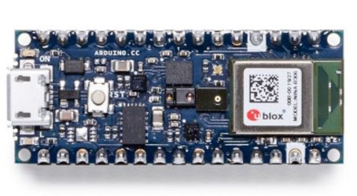
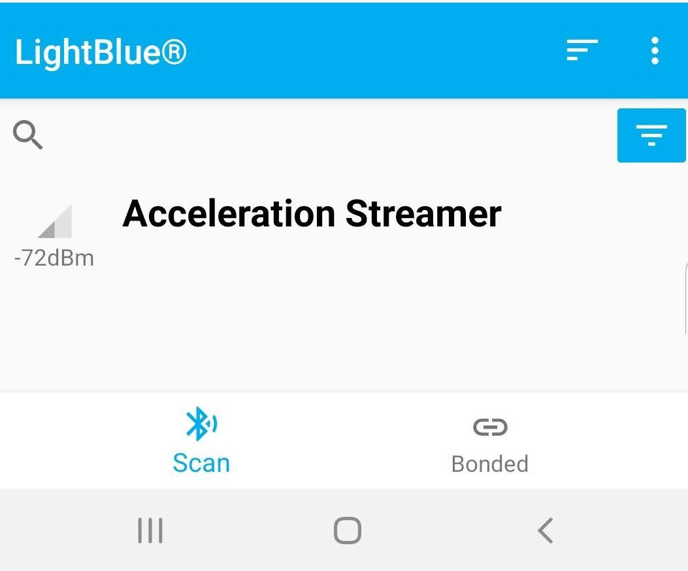
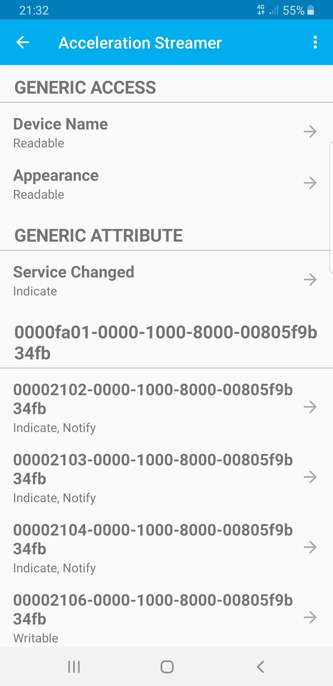
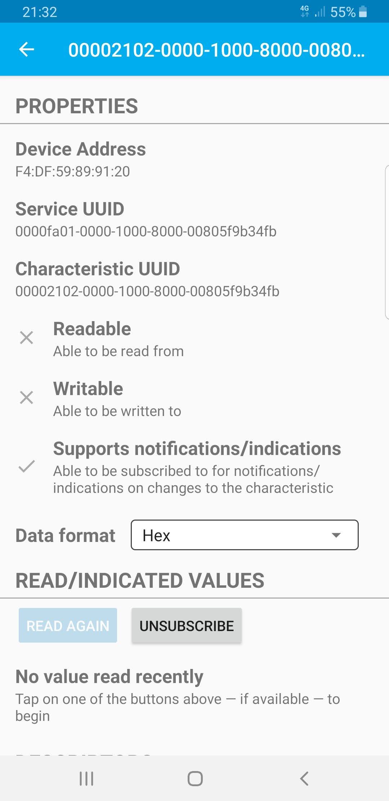
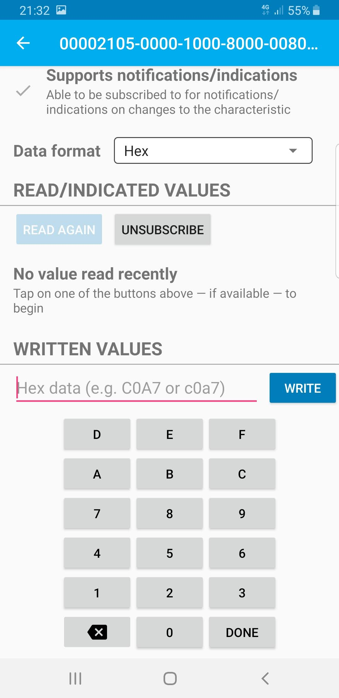
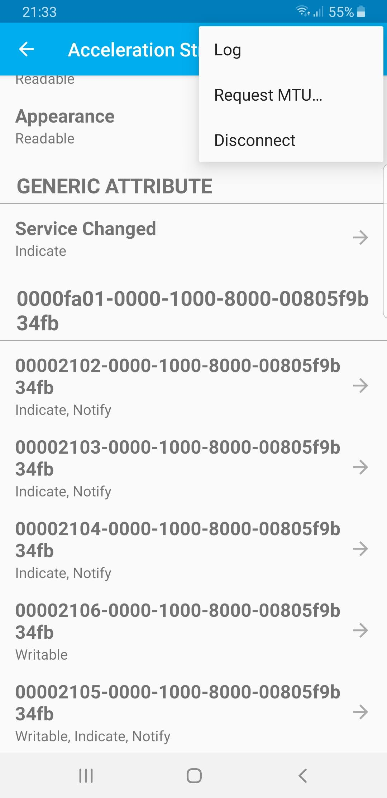
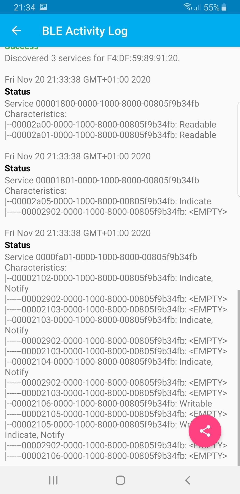

# data_collection_ble

Use Arduino Nano 33 ble sense to record acceleraions. 
This board have an builtin Inertial Measurement Unit (IMU), and a Bluetooth Low Energy (BLE) chip. 
This sketch set the Arduino as a BLE peripheral and stream the records via BLE.

## Collect the accelerations using LightBlue for android

Instruction:

- 1 Upload data_collection_ble.ino using Arduino IDE.

- 2 Connect the phone to the **Acceleration Streamer** service.

- 3 Subscribe to the characteristic of UUIDs **2102**, **2103**, **2104** and **2105** for get a notification after every update.

- 5 Set the label: Click on the caracteristic of **UUID 2105** and write the label.

|value|label|
|:---:|:----:|
|0|walk|
|1|run|

- 6 Set the characteristic of UUID **2106** to 1 to start recording.

- 5 Click on the 3 dots then log and then save the log.

