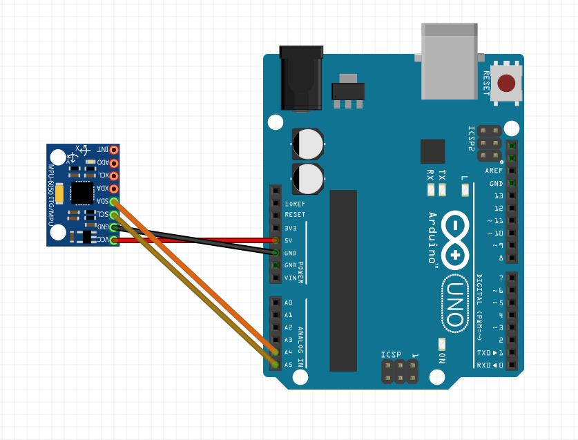
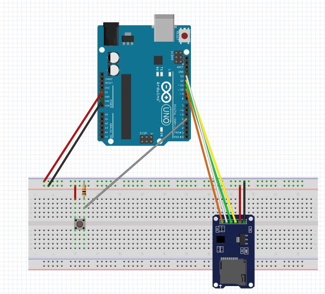
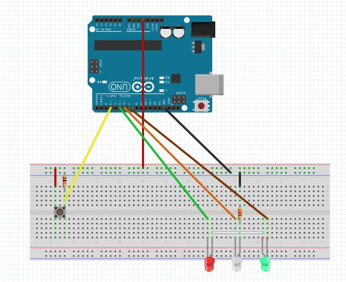

# Record acceleration

Record the acceleration during a running or walking session.

## Hardware

* Arduino Uno
* MPU6050
* SD card writer
* 3 x LEDs
* 2 x Buttons
* 2 x 10k resistor
* 1 x 320 resistor

## Wiring

### Accelerometer MPU6050

This sensor record the acceleration on X, Y, Z axis.

### SD card writer and record system

Save on a SD card the value of the acceleration.
Press the button for start/stop the acquisition.

### Mode selection

Create the label of the dataset.

## Instruction

* Chose the good label by pressing the Select button
* Press the Record button to start the recording the acceleration.
* Run or walk
* Press again the Record button for stop.
